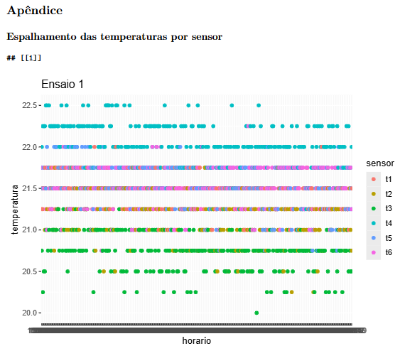

# R SENSOR DATA ANALYSIS

This is my first R project!!!

The data acquisition was made using 6 k type thermocouples, MAX6675 modules and an esp32, if you are interested into the hardware part of the project, check this repo: [https://github.com/El-Tomaz/TELEMETRIA-PAINEL-SOLAR](https://github.com/El-Tomaz/TELEMETRIA-PAINEL-SOLAR).

Data were colected in 5 different temperature tests, on each teste the thermocouples were inserted into a thermoestatic bath, with temperature precision of ~ +- 0.1 °C. A mercury thermometer were used to check the bath real temperature on all the process. Each measurement took 5 minutos to grant sensor thermic estabilization.

The selected temperatures were 20°C, 25°C, 30°C, 35°C and 40°C.

## Repository description

- [termopar2.Rmd](./termopar2.Rmd): Sourcecode writed on RMarkdown, this is where all work was done, check this file to see my work.
- [termopar2.pdf](./termopar2.pdf): Result file of the source code. Check this file to see the report resulted from this project.
- [termopar.csv](./termopar.csv): Raw temperature data.

Other files are just old versions, i keep them for comparation.

## Some result prints

## What i have learned

- R basic sintax
- Dataframe creation and manipulation
- Wide and Long format conversion
- Charts creation with ggplot2
- Use of RMarkdown

Packages used in this project:

- [ggplot2](https://ggplot2.tidyverse.org/)
- [tidyr](https://tidyr.tidyverse.org/)
- [lubridate](https://lubridate.tidyverse.org/)
- [lemon_print](https://cran.r-project.org/web/packages/lemon/vignettes/lemon_print.html)